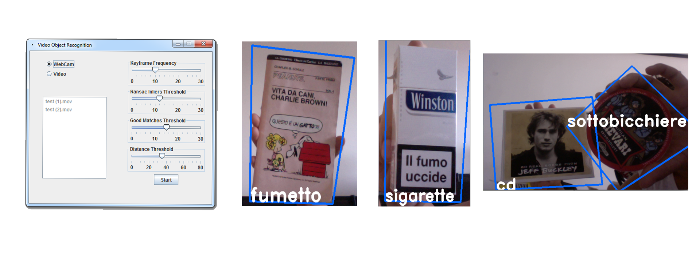

# Visual recognition with multiple objects and homography
##Summary
An application able to recognize (classify) various 3D objects (at least 10) appearing in a video stream. Using geometric verification and homography to contour the recognized object.
##Objectives
- Implementing visual recognition on a video stream
- Local features based matching
- Augmenting the reality with with homography based contouring
- Searching between the training data the most similar object/image/face and determining if it is the very same.

##Dataset
At least 10 objects should be recognized.

##Expected results
- features extraction
- features matching
- Homography understanding
- fluid video displaying

##Suggested tools
- OpenCV

##Screenshots:
